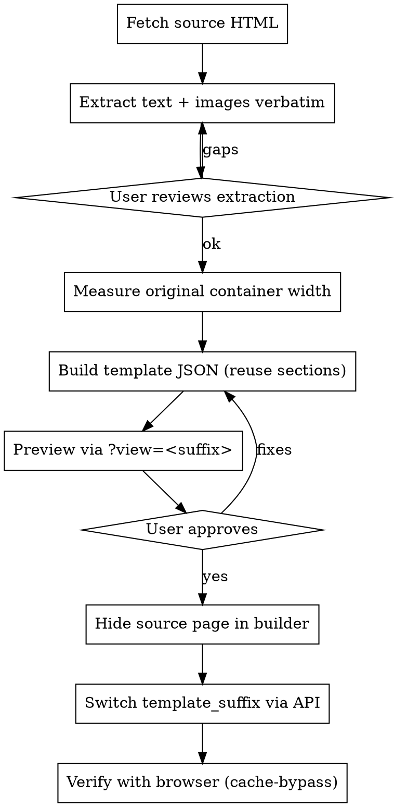

# Shopify PageFly → Native Migration

## Overview

Migrate a Shopify product page from a third-party page builder (PageFly, GemPages, Shogun, etc.) to native theme sections. The goal is faithful reproduction of the original page using reusable custom Liquid sections instead of the builder's runtime.

**Core principle**: Extract everything first, reuse sections across products, measure before implementing, verify with browser evidence.

## When to Use

- Converting a product page off PageFly/GemPages/Shogun to native Liquid
- Consolidating multiple page-builder pages into a reusable section library
- Removing page-builder dependency to reduce runtime cost or unlock native theme features
- Re-skinning a product page while keeping the original content intact

## Prerequisites

Before running the workflow, complete the following setup. Budget 15–30 minutes the first time; subsequent migrations reuse everything.

### 1. Shopify store admin access

You need to be a store owner or a staff account with "Apps and channels" and "Themes" permissions. If you are not the owner, the owner must grant these.

### 2. Create a custom Shopify app

From the Shopify admin:

1. **Settings → Apps and sales channels → Develop apps**
2. Click **Create an app**, name it something like `Claude Migration Tool`
3. Open the app → **Configuration → Admin API integration → Configure**
4. Enable these scopes:
   - `write_themes` — upload section/template files
   - `read_products`, `write_products` — read handle, update `template_suffix`
   - `read_themes` — list themes to find the main theme ID
   - (Optional) `write_files`, `read_files` — if your sections reference CDN assets you upload
5. Save, then **API credentials → Install app**
6. After install, copy the **Admin API access token** (shown once — if you miss it, rotate and copy again)
7. Also copy the **API key** and **API secret key** (only needed if you prefer OAuth `client_credentials` exchange instead of a static token)

> **Note**: Shopify offers two auth paths: a static **Admin API access token** (simpler, preferred for this workflow) or **OAuth `client_credentials`** exchange (tokens expire every 24 hours). The workflow below assumes the static token.

### 3. Store credentials in a `.env` file

Create a `.env` file at your working root (never check it into git):

```bash
SHOPIFY_STORE=your-store.myshopify.com
SHOPIFY_ACCESS_TOKEN=shpat_xxxxxxxxxxxxxxxxxxxxxxxxxxxxxxxx
# If using OAuth client_credentials instead:
# SHOPIFY_CLIENT_ID=xxxxxxxxxxxxxxxxxxxxxxxxxxxxxxxx
# SHOPIFY_CLIENT_SECRET=xxxxxxxxxxxxxxxxxxxxxxxxxxxxxxxx
```

Add `.env` to `.gitignore` immediately.

### 4. Identify the theme ID

The workflow uploads assets to the **main (published) theme**. To find its ID:

```bash
curl -sX GET "https://$SHOPIFY_STORE/admin/api/2024-10/themes.json" \
  -H "X-Shopify-Access-Token: $SHOPIFY_ACCESS_TOKEN" \
  | python3 -c "import sys,json; print([t for t in json.load(sys.stdin)['themes'] if t['role']=='main'][0]['id'])"
```

For safety during development, consider duplicating the main theme and pointing your upload script at the duplicate until you verify the result, then promoting.

### 5. Theme development permissions

The user driving the migration must be able to:

- **Preview a template** — test `https://store.com/products/handle?view=<suffix>` from a browser logged in as store staff (customer sessions do not see unpublished templates)
- **Publish a theme** — if you work on a duplicate theme and want to promote it after verification
- **Access the page builder** — PageFly/GemPages/Shogun have their own admin pages. The migrator must be able to hide the source page inside the builder's UI (API access alone is not enough)

### 6. Minimal upload script

A small Python script handles token exchange and asset PUTs. At minimum it needs:

```python
import os, requests
from pathlib import Path

STORE = os.environ["SHOPIFY_STORE"]
TOKEN = os.environ["SHOPIFY_ACCESS_TOKEN"]
HEADERS = {"X-Shopify-Access-Token": TOKEN, "Content-Type": "application/json"}

def upload_asset(theme_id: int, key: str, path: Path):
    r = requests.put(
        f"https://{STORE}/admin/api/2024-10/themes/{theme_id}/assets.json",
        headers=HEADERS,
        json={"asset": {"key": key, "value": path.read_text(encoding='utf-8')}},
        timeout=60,
    )
    r.raise_for_status()
    return r.json()
```

Keep one `upload.py` per product folder that imports credentials from `.env`. Avoid hardcoding store or theme IDs in checked-in code.

### 7. Reusable custom section library

The workflow assumes you have (or will build during the first migration) a set of custom Liquid sections. Typical files:

- `sections/custom-content-section.liquid`
- `sections/custom-step-flow.liquid`
- `sections/custom-feature-grid.liquid`
- `sections/custom-intro-badge.liquid`
- `sections/custom-text-block.liquid`

The first migration on a new theme bootstraps this library; every later migration reuses it by referencing the section types in the product template JSON.

### 8. API version

All examples use `2024-10`. Shopify rotates API versions quarterly. Check the Shopify API release notes and bump the version in your script periodically — the Admin REST endpoints used here (`/themes/*/assets.json`, `/products/*.json`) are stable across recent versions.

### 9. Rate limits

Shopify's REST bucket is 40 requests / app / store by default (80 for Plus). A single migration uses perhaps 10–20 calls, so rate limits are not a concern. If you script bulk migrations, watch the `X-Shopify-Shop-Api-Call-Limit` header.

## The Workflow



### 1. Fetch the live source

```bash
curl -sL "https://<store>/products/<handle>" -o pagefly-source.html
```

Save it in the product's working folder. Do not delete it — it is the source of truth for extraction verification.

### 2. Extract all text and images — verbatim

**Do not summarize, rephrase, invent, or skip anything.** This is the #1 cause of rework.

Create three files:
- `extracted-content.md` — sections with headings, body text, and positional image list
- `extracted-texts.txt` — all text blocks, one per line (grep checklist)
- `extracted-images.txt` — all image URLs, one per line (grep checklist)

Use a subagent for this if the page is large — it protects main context. Instruct the subagent to:
- Use `>text<` parsing for text nodes
- Extract CDN image URLs from `src`, `data-src`, `srcset`
- Preserve original typos, awkward phrasing, and Chinese/English remnants — faithful = faithful
- Flag data corruption (e.g. Q3 question = A3 answer) but **do not auto-fix** it
- Count text blocks, image URLs, and logical sections
- Separate facts from inferences

### 3. Have the user review the extraction

Don't skip this. The extraction document is the user's only chance to catch missing content before you start implementing. Ask them to confirm:
- Scope (full migration vs. just extraction)
- Section library reuse vs. new sections
- How to handle source corruption (restore, delete, or transcribe-as-is)
- Whether to fix original typos

### 4. Measure the original container width

Before choosing a `max-width`, find the actual width the builder used. For PageFly, grep for `--cw`:

```bash
grep -oE "\-\-cw:[0-9]+px" pagefly-source.html | sort -u
```

PageFly often renders detail content at `--cw:700px` even when the theme container is 1200px. Matching this exactly prevents "too wide" complaints.

Also measure the theme's product info (`.is-product-main` or equivalent) container width using Chrome DevTools on the live page **before** switching. The theme may constrain it to 1200px via a `.shopify-section-wrapper` ancestor.

### 5. Build the template JSON

Create `templates/product.<suffix>.json` reusing existing custom sections. Typical section library:

| Section | Purpose |
|---|---|
| `custom-content-section` | Text + image blocks with `image_layout` (auto/single/first-full) |
| `custom-step-flow` | Numbered step list (supports `|||`-delimited multi-image per step) |
| `custom-feature-grid` | Card grid (2/3/4 columns) |
| `custom-intro-badge` | Hero with badge image |
| `custom-text-block` | Text-only paragraph |
| `custom-html` | Escape hatch for YouTube, FAQ `<details>`, CSS overrides |

**Schema caching rule**: Do not add new fields to an existing block schema mid-migration. Shopify's schema cache can drop the values silently. Workarounds:
- Store multiple values in one existing field with a `|||` delimiter and split in Liquid
- Use blocks instead of fixed fields
- Create a new section file with a new name

**Section reuse across products**: Make `max_width` a section setting with a default, so each product can override without forking the section. Example:

```liquid

<div class="custom-content-section" style="max-width:{{ max_w }}px;">
```

```json
{ "type": "number", "id": "max_width", "label": "最大幅(px)", "default": 900 }
```

### 6. Upload template and sections to the theme

```
PUT /admin/api/YYYY-MM/themes/{theme_id}/assets.json
{"asset": {"key": "templates/product.<suffix>.json", "value": "<file content>"}}
```

Upload any modified section files (`sections/<name>.liquid`) the same way. Uploading only the template is not enough if section logic changed.

### 7. Preview via `?view=<suffix>`

```
https://<store>/products/<handle>?view=<suffix>
```

This renders the product with the new template without switching `template_suffix` — safe for user review.

**⚠ Preview pitfall**: The preview view may **not** wrap the page in `.shopify-section-wrapper`. This causes `.is-product-main` and other top-level sections to expand to full viewport (e.g. 2133px on a wide display) instead of being capped at the theme's container width (usually 1200px). Measure with DevTools.

Fix by scoping a CSS override to the template's body class:

```html
<style>
body.product-<suffix> .shopify-section--product-template.is-product-main,
body.product-<suffix> .shopify-section--custom-html {
  max-width: 1200px;
  margin-left: auto;
  margin-right: auto;
}
</style>
```

Drop it in a `custom-html` section at the top of the template (before `main`). This also matches the live behavior, so it stays correct after the `template_suffix` switch.

### 8. Hide the source page BEFORE switching

Open the page builder UI (PageFly, etc.) and **hide** the original page. Do not delete — hide. Deleting is irreversible; hiding leaves a rollback path. If this step is skipped, the `template_suffix` switch can leave the product in an inconsistent state (observed: `template_suffix` silently reverting to `product`).

This step requires user action — you cannot hide builder pages via the Shopify Admin API.

### 9. Switch `template_suffix` via API

```python
PUT /admin/api/YYYY-MM/products/{id}.json
{"product": {"id": <id>, "template_suffix": "<suffix>"}}
```

Fetch the product by handle first if you only have a handle:

```graphql
{ productByHandle(handle: "<handle>") { id legacyResourceId templateSuffix } }
```

### 10. Verify — with the browser, not curl

Shopify's CDN can return stale HTML to `curl` for minutes or longer after a template switch. Do not trust `curl` as verification. Use a real browser session and check:

- `document.body.className` contains `product-<suffix>`
- `!!document.querySelector('.custom-content-section')` is `true`
- `!!document.querySelector('.__pf')` is `false` (no more PageFly DOM)
- Key section widths match expectations
- A re-fetch of the product via API shows the new `template_suffix`

Googlebot always does fresh crawls, so stale edge cache has no SEO impact.

## Critical Lessons

### Faithful reproduction is non-negotiable

Do not invent headings, card titles, descriptions, or any text. Do not summarize. Do not drop images. If the original has typos, keep them (unless the user explicitly approves correction in the same turn). The user knows what was on the page and will catch every fabrication.

### Measure, don't guess

Before choosing any `max-width`, measure the source container width AND the theme's live container width. Choosing a number that "looks about right" produces repeated rework.

### Avoid schema additions mid-migration

Adding a new field to an existing section schema often appears to succeed (API returns 200, JSON looks right) but the rendered HTML silently drops the values. The cache is sticky. Use delimited existing fields or blocks.

### One section library, many products

Keep the set of custom sections small and unified. Do not create product-specific variants. Per-product customization should come from section settings (`max_width`, `image_layout`, etc.), not from forking section files.

### Completion means evidence

"Uploaded" ≠ "live". "200 OK" ≠ "rendered". Always verify the rendered HTML (via browser) contains your custom section markers and expected content. Document the verification — what you checked and what you saw — in the project folder.

### Hide before switch

The PageFly→native template switch must happen in this order:
1. Hide the source page in the builder
2. Upload native template + sections
3. Switch `template_suffix`
4. Verify with browser

Skipping step 1 has produced `template_suffix` reverts that took a full day to diagnose.

## Common Mistakes

| Symptom | Cause | Fix |
|---|---|---|
| "Too wide" on wide monitors | Preview mode lacks `.shopify-section-wrapper` | Add CSS override scoped to `body.product-<suffix>` |
| Images dropped silently | Schema field added mid-migration | Use `|||`-delimited existing field |
| "You invented this heading" | Summarized instead of extracting | Re-extract verbatim, verify with grep |
| `curl` still shows old page | CDN edge cache | Verify with browser, not curl |
| `template_suffix` reverted | Skipped "hide source first" step | Hide in builder, re-apply via API |
| Width inconsistent across sections | Hardcoded widths per section | Make `max_width` a section setting |

## Verification Checklist

Before claiming "done":

- [ ] All text from the source HTML exists in the rendered page (grep verified)
- [ ] All image URLs from the source exist in the rendered page (grep verified)
- [ ] `template_suffix` confirmed via GET on the product API
- [ ] Browser-rendered body class matches the new template
- [ ] No page-builder runtime DOM on the rendered page (e.g. `.__pf`, `.gf-page`)
- [ ] Section widths match the measured source widths
- [ ] Preview URL (`?view=<suffix>`) and live URL render identically
- [ ] User has visually confirmed on the live URL (not just preview)

## Tools

- `curl` — fetch source HTML, verify assets uploaded
- Python `requests` + Shopify Admin API — token exchange, asset upload, product update
- Chrome DevTools — measure actual rendered widths
- A simple `upload.py` script per product folder that reuses credentials from a shared `.env` file (never check credentials into the repo)

## Notes

This workflow assumes the theme already has a set of reusable custom sections. If you are doing the first migration on a new theme, the section library needs to be built alongside the first product — budget extra time for that. Subsequent migrations are much faster because they only produce a JSON template.
